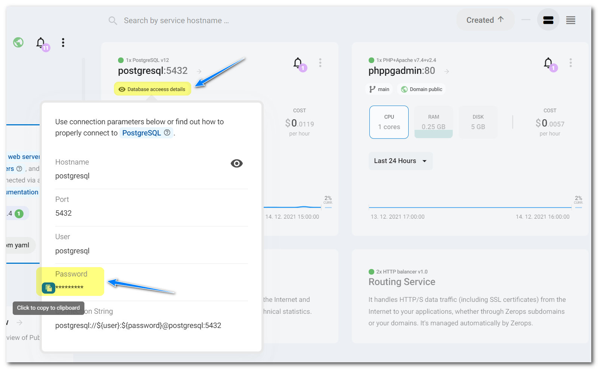

# ZEROPS RECIPES

The concept of pre-prepared skeletons demonstrates the way how to set up and use technologies Zerops is supporting.

## phpPgAdmin 7.13.0

[phpPgAdmin](https://github.com/phppgadmin/phppgadmin) is a mature web-based administration tool for the PostgreSQL database.

## Zerops import syntax

```yaml
services:
  # Service will be accessible through zcli VPN under: http://phppgadmin
- hostname: phppgadmin
  # Type and version of a used service.
  type: php-apache@7.4+2.4
  # Whether the service will be run on one or multiple containers.
  # Since this is a utility service, using only one container is fine.
  mode: NON_HA
  # Repository that contains phpPgAdmin code with build and deploy instructions.
  buildFromGit: https://github.com/zeropsio/recipe-phppgadmin@main
  # Setting of the "DATABASE_HOSTNAME" environment variable.
  # It specifies the chosen hostname for the Zerops PostgreSQL service that should be managed.
  envVariables:
    # Here, the Zerops PostgreSQL service's chosen hostname is "postgresql".
    # Change it if you need to use a different one.
    DATABASE_HOSTNAME: postgresql
```

Copy & paste the import snippet above into the dialog of **Import service** functionality.


See the [Zerops documentation](https://docs.zerops.io/documentation/export-import/project-service-export-import.html) to understand how to use it.

## Using the recipe

1. Use the Zerops [importing](/documentation/export-import/project-service-export-import.html#how-to-export-import-a-project) functionality to import [recipe service](#zerops-import-syntax) into your already existing Zerops project.

2. Wait till the moment when a service will be created and running.


3. Open the **phppgadmin** PHP service to get access to its details.

4. Open the **Private & public access** section in detail and turn on the switch **Enable Zerops Subdomain Access**. Wait till the moment it's processed.


5. Click on the activated subdomain URL to open a new web page to show the welcome page of **phpPgAdmin**.


6. Click on the **PostgreSQL** link to show a login page.


7. As the **Username** enter the [chosen hostname](https://docs.zerops.io/documentation/services/databases/postgresql.html#hostname-and-ports) of the Zerops PostgreSQL service you want to access. The ==**postgresql**== value was mentioned above and shown in the import syntax.

8. The user password can be taken from the **Database access details** section of the Zerops PostgreSQL service.



9. The [default database](https://docs.zerops.io/documentation/services/databases/postgresql.html#default-postgresql-database) should be fully accessible.


10. In the end, **don't forget to disable** the Zerops subdomain access. Finally, you can delete the service from your project to keep it clear and **save your free or paid Zerops credit** because you can always recreate it entirely from the beginning.

11.  Instead of using a Zerops subdomain, you can [map your public domain](http://docs.zerops.io/documentation/routing/using-your-domain.html) to access the service.
